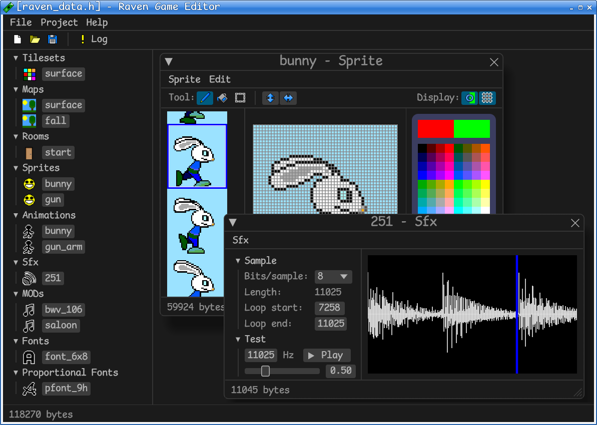

# raven-game-editor

This is a small asset editor for games that run in the Raspberry Pi Pico. The editor is written in Rust using [egui](https://github.com/emilk/egui).

Here's a screenshot of the of the editor with a bunny sprite open:

